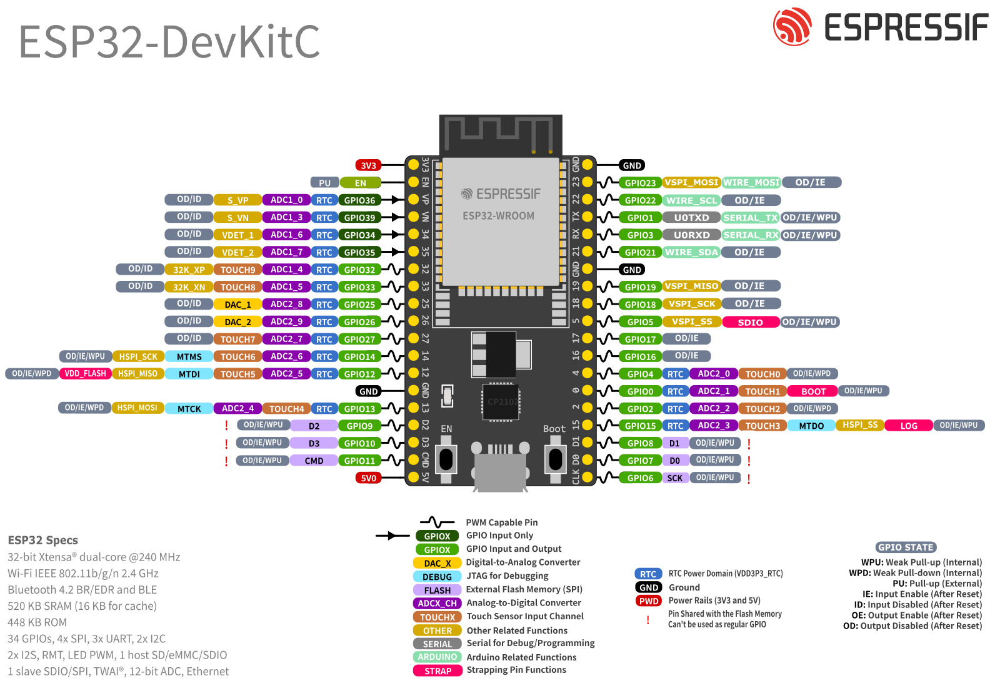

<!--
 * @Author: ka1shu1 cwh979946@163.com
 * @Date: 2026-04-20 09:48:47
 * @LastEditors: ka1shu1 cwh979946@163.com
 * @LastEditTime: 2026-04-20 09:49:25
 * @FilePath: \final project\docs\ref\esp32.md
 * @Description: 这是默认设置,请设置`customMade`, 打开koroFileHeader查看配置 进行设置: https://github.com/OBKoro1/koro1FileHeader/wiki/%E9%85%8D%E7%BD%AE
-->
